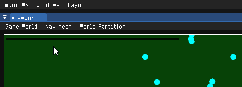
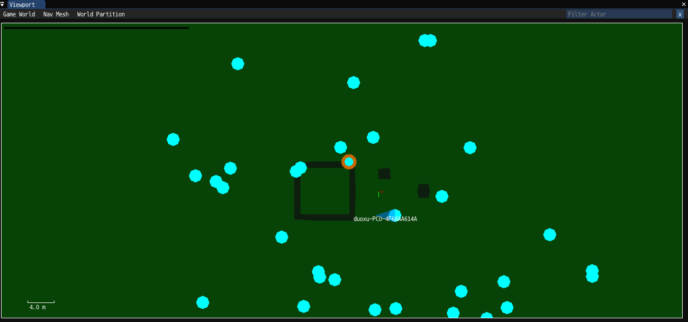
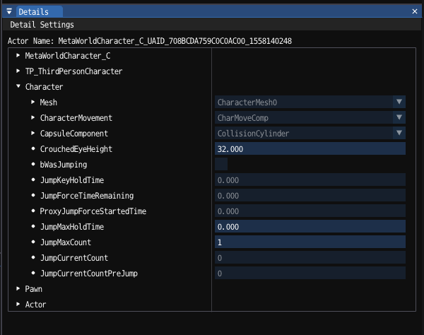
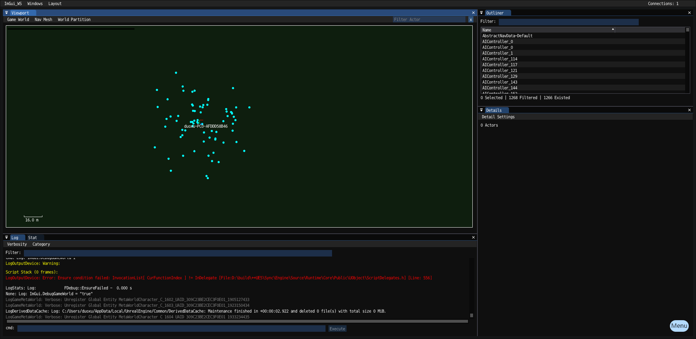

# ImGui_WS

[中文ReadMe点击这里](README_ZH.md)

[[toc]]


The ImGui_WS plugin provides the ability to display Unreal debugging information on a remote web page, also supports packaged game. (e.g. standalone DS processes can use this debugger to visualize in-game data)

## Feature

* ImGui web drawing
* Unreal World Debugger
  * Unreal world top view
  * Details panel
  * World outline view
  * Log and console
* Panel layout system
* ImPlot data visualization library

## Learn how to use ImGui

Select ImGui_WS on the ImGui webpage, check ImGuiDemo to open the Demo panel  
For code viewing **ImGuiDemo.cpp**, refer to the widget drawing method required for copying the Demo panel  
> [imgui_manual](https://pthom.github.io/imgui_manual_online/manual/imgui_manual.html) demo网页版  

## Web drawing

Click the ImGui button in the lower right corner to open the corresponding webpage, or enter **ImGui.WS.LaunchWeb** in the console to open the webpage

> ImGui_WS drawing is only enabled by default in the editor, and the packaged DS or client is added in the startup parameters
> -ExecCmds="ImGui.WS.Enable 1"
> to enable drawing

### Switch world context

  
The previewed world can be selected through the world context option under the ImGui_WS menu

### Port configuration

You can set the port number through Config or the command line

1. Configurable port number in ProjectSettings - Plugins - ImGui_WS
2. ImGui_WS.ini configuration file
    > [/Script/ImGui_WS.ImGui_WS_Settings]  
    GamePort=8890  
    ServerPort=8891  
    ServerPort=8892  

3. Startup parameter configuration -ExecCmds="ImGui.WS.Port 8890"

### Draw event

UImGui_WS_Manager::GetImGuiContext gets ImGuiContext
Member OnDraw is the event called for ImGui_WS drawing
Bind this event to call ImGui to draw a specific panel

## World Debugger

World Debugger is the default runtime unreal world debugger provided by this plugin, which provides the function of previewing and setting Actor properties in the game world

> Configurable console variable ImGui.DebugGameWorld controls whether to enable the debug panel, enabled by default
> If you need to disable this function, you can set ImGuiWorldDebuggerBootstrap::bLaunchImGuiWorldDebugger = false in the game module StartupModule;

## Unreal top view

> In order to avoid displaying too many unrelated Actors, the default preview will only display Actors that inherit the UImGuiWorldDebuggerDrawerBase declaration.

  

### Filter Actors by Type

After entering **type:ClassPath** in the FilterActor search box, only the Actor of the current type will be displayed in the map

### Add the Actor type that needs to be visualized

Create a type that inherits from UImGuiWorldDebuggerDrawerBase

* Add constructor

``` cpp
UShootWeaponBulletDrawer::UShootWeaponBulletDrawer()
{
	// Declare the Actor types supported by the Drawer
	DrawActor = AShootWeaponBullet::StaticClass();
	// Drawn solid radius
	Radius = 10.f;
	// Painted color
	Color = FLinearColor::Red;
}
```

* Rewrite functions such as DrawImGuiDebuggerExtendInfo to add extra debugging information to draw

``` cpp
void UShootWeaponBulletDrawer::DrawImGuiDebuggerExtendInfo(const AActor* Actor, const FImGuiWorldViewportContext& DebuggerContext) const
{
	const AShootWeaponBullet* Bullet = CastChecked<AShootWeaponBullet>(Actor);
	const FVector EndLocation = Bullet->GetActorLocation();
	const FVector StartLocation = EndLocation - Actor->GetVelocity() * DebuggerContext.DeltaSeconds;
	DebuggerContext.DrawLine(FVector2D{ StartLocation }, FVector2D{ EndLocation }, Color);
}
```

### Add extra world info to draw

Inherit UImGuiWorldDebuggerViewportPanel and override the following virtual functions

* DrawDebugInfoUnderActors draws additional debug info under Actors
* DrawDebugInfoUpperActors draws additional debug information on top of Actors

It is recommended to add a **switch** to each world debugging information to avoid displaying too many elements in the debugging world at the same time

``` cpp
// declare switch
UPROPERTY(Config)
uint8 bExampleToggle : 1;

// Add the menu option of whether to enable the switch in the implementation
if (ImGui::BeginMenu("Example Menu"))
{
	{
		bool Value = bExampleToggle;
		if (ImGui::Checkbox("Example Toggle", &Value))
		{
			bShowGlobalLifeTime = Value;
			DebuggerContext.MarkConfigDirty();
		}
	}
	ImGui::EndMenu();
}

// The switch is judged in the logic, and the debug information is drawn when it is turned on.
```

## UObject Details Panel

Can draw all the properties of the incoming UObject instance, support multi-select editing

  

For usage, please refer to **UImGuiWorldDebuggerDetailsPanel::Draw**

### Add custom types of drawing methods

See how **FStructCustomizerScoped** is used

## Panel layout System

  

### Overview

* Inherit UImGuiWorldDebuggerPanelBase to add a new panel to ImGuiWorldDebugger
* Inherit UImGuiWorldDebuggerLayoutBase to add layout description to ImGuiWorldDebugger

### UnrealImGuiPanelBuilder

FUnrealImGuiPanelBuilder is used to build the layout of its own window, and the following parameters need to be configured

| property          | describe                                                                                |
|-------------------|-----------------------------------------------------------------------------------------|
| DockSpaceName     | the name of the layout system                                                           |
| SupportLayoutType | Supported layout types, subclasses of the layout will be collected to the layout system |
| SupportPanelType  | Supported panel types, subclasses of this panel will be collected to this layout system |

After configuring the description information of the layout system, call the following method to draw the panel

| method            | describe                                                  |
|-------------------|-----------------------------------------------------------|
| Register          | Register the layout system and call it when it is created |
| Unregister        | Unregister the layout system, called when destroyed       |
| DrawPanels        | draws the panels under this layout system                 |
| LoadDefaultLayout | Reload activate layout                                    |

### Add layout

Inherit the layout base class types supported under FUnrealImGuiPanelBuilder, for example, ImGuiWorldDebugger extends the layout and inherits UImGuiWorldDebuggerLayoutBase

* Configure LayoutName, layout without layout name will not be displayed
* Override LoadDefaultLayout to declare the default layout structure

#### ImGuiWorldDebugger default layout example

The default layout divides the viewport into four areas

``` cpp
UCLASS()
class UImGuiWorldDebuggerDefaultLayout : public UImGuiWorldDebuggerLayoutBase
{
	GENERATED_BODY()
public:
	// Declare the DockId as the configuration when the panel registers the Dock
	enum EDockId
	{
		Viewport,
		Outliner,
		Details,
		Utils,
	};
	UImGuiWorldDebuggerDefaultLayout();
	void LoadDefaultLayout(UObject* Owner, const FUnrealImGuiPanelBuilder& LayoutBuilder) override;
};
```

``` cpp
UImGuiWorldDebuggerDefaultLayout::UImGuiWorldDebuggerDefaultLayout()
{
	// Set layout name
	LayoutName = LOCTEXT("Default", "Default");
}

void UImGuiWorldDebuggerDefaultLayout::LoadDefaultLayout(UObject* Owner, const FUnrealImGuiPanelBuilder& LayoutBuilder)
{
	const ImGuiID DockId = ImGui::DockBuilderAddNode(DockSpaceId, ImGuiDockNodeFlags_None);

	// Call DockBuilderSplitNode to divide the layout
	ImGuiID RemainAreaId;
	ImGuiID ViewportId = ImGui::DockBuilderSplitNode(DockSpaceId, ImGuiDir_Left, 0.7f, nullptr, &RemainAreaId);
	const ImGuiID UtilsId = ImGui::DockBuilderSplitNode(ViewportId, ImGuiDir_Down, 0.3f, nullptr, &ViewportId);
	const ImGuiID OutlinerId = ImGui::DockBuilderSplitNode(RemainAreaId, ImGuiDir_Up, 0.3f, nullptr, &RemainAreaId);
	const ImGuiID DetailsId = ImGui::DockBuilderSplitNode(RemainAreaId, ImGuiDir_Down, 0.7f, nullptr, &RemainAreaId);

	// Add a mapping relationship between the declared DockId and the actual ID of ImGui
	const TMap<int32, ImGuiID> DockIdMap
	{
		{ Viewport, ViewportId },
		{ Outliner, OutlinerId },
		{ Details, DetailsId },
		{ Utils, UtilsId },
	};
	// Subpanel application layout information
	ApplyPanelDockSettings(LayoutBuilder, DockIdMap, EDockId::Utils);

	ImGui::DockBuilderFinish(DockId);
}
```

### Add panel

Inherit the panel base class types supported under FUnrealImGuiPanelBuilder. For example, the ImGuiWorldDebugger extension panel inherits UImGuiWorldDebuggerPanelBase

* Configure Title, unnamed panels will not be registered
* Configure DefaultDockSpace, add the position of the panel in the layout
* Rewrite Draw to realize panel drawing

#### ImGuiWorldDebuggerViewportPanel panel example

``` cpp
UImGuiWorldDebuggerViewportPanel::UImGuiWorldDebuggerViewportPanel()
{
	// Declares that the menu bar needs to be displayed
	ImGuiWindowFlags = ImGuiWindowFlags_MenuBar;
	// Set panel name
	Title = LOCTEXT("Viewport", "Viewport");
	// The default position in the ImGuiWorldDebuggerDefaultLayout layout is Viewport
	DefaultDockSpace =
	{
		{ UImGuiWorldDebuggerDefaultLayout::StaticClass()->GetFName(), UImGuiWorldDebuggerDefaultLayout::EDockId::Viewport }
	};
}
```

## Bubbling message

[imgui-notify](https://github.com/patrickcjk/imgui-notify)

Call **ImGui::InsertNotification** to use the global bubbling message  

  

## Record drawing data and playback (experimental)

### Recording method

Start recording:

* Menu->ImGui_WS->Start Record
* Console input ImGui.WS.StartRecord

To end recording:

* Menu->ImGui_WS->Stop Record
* Console input ImGui.WS.StopRecord

### Play back recorded data

Menu->ImGui_WS->Load Record, select the recorded file for review

## Credits

* [ImGui](https://github.com/ocornut/imgui)
  ImGui's repository, which contains ImGui's Wiki
* [imgui-ws](https://github.com/ggerganov/imgui-ws)
  Implemented ImGui web page drawing
