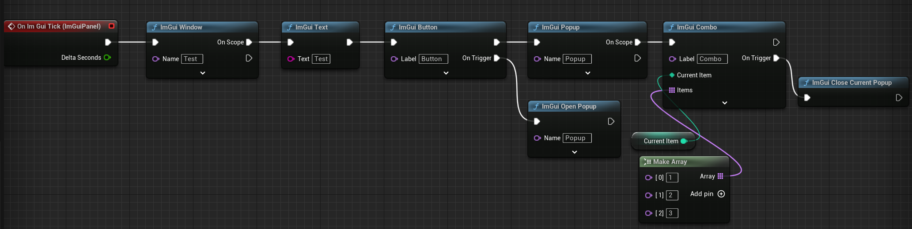

# ImGui_WS

[中文](README_ZH.md) | [English](README.md)

[[toc]]


ImGui_WS插件提供了虚幻调试信息远程网页显示的能力，支持打包后生效。（例如独立的DS进程可以用这个调试器可视化预览游戏内的数据）

## 特性

* ImGui网页绘制
* 本地Slate面板绘制
* UMG支持
* ImGui蓝图节点（自动管理作用域）
* 虚幻世界调试器
  * 虚幻世界俯视图
  * 细节面板
  * 世界大纲视图
  * 日志与控制台功能
* 面板布局系统
* ImPlot数据可视化库
* C++ RAII API

## 学习如何使用ImGui

在ImGui网页选择ImGui_WS，勾选ImGuiDemo打开Demo面板  
代码查看**ImGuiDemo.cpp**可参考Demo面板复制所需的控件绘制方法  
> [imgui_manual](https://pthom.github.io/imgui_manual_online/manual/imgui_manual.html) demo网页版  

## 网页绘制

点击右下角的ImGui按钮开启对应的网页，或者控制台输入**ImGui.WS.LaunchWeb**打开网页

> ImGui_WS绘制只在编辑器下默认启用，打包后的DS或者客户端在启动参数添加  
> -ExecCmds="ImGui.WS.Enable 1"  
> 来启用绘制

### 切换世界上下文

  
通过ImGui_WS菜单下的世界上下文选项可选择预览的World

### 端口号配置

可以通过Config或者命令行来设置端口号

1. ProjectSettings - Plugins - ImGui_WS 中可配置端口号
2. ImGui_WS.ini配置文件
    > [/Script/ImGui_WS.ImGui_WS_Settings]  
    GamePort=8890  
    ServerPort=8891  
    EditorPort=8892  

3. 启动参数配置 -ExecCmds="ImGui.WS.Port 8890"

### 绘制事件

* 从**UImGui_WS_Manager::GetImGuiContext**获取到ImGuiContext  
* 成员**OnDraw**为ImGui_WS绘制调用的事件  
* 绑定该事件调用ImGui绘制特定的面板

### 绘制图片

1. UnrealImGui::FImGuiTextureHandle创建图片的句柄
2. 调用UnrealImGui::UpdateTextureData更新图片信息
3. ImGui::Image绘制该图片

``` cpp
static UnrealImGui::FImGuiTextureHandle TextureHandle = []
{
    UTexture2D* Texture2D = LoadObject<UTexture2D>(nullptr, TEXT("/Engine/EditorResources/S_Actor"));
    // 步骤1
    const UnrealImGui::FImGuiTextureHandle Handle{ Texture2D };
    // 步骤2
    UnrealImGui::UpdateTextureData(Handle, UnrealImGui::ETextureFormat::RGB8, Texture2D);
    return Handle;
}();
// 步骤3
ImGui::Image(TextureHandle, ImVec2{ 256.f, 256.f });
```

## 本地Slate面板绘制

控制台变量 `ImGui.WS.LocalPanelMode <ELocalPanelMode>` 设置本地面板模式

* 0: 在当前游戏的面板上绘制  
  
* 1: 打开一个独立窗口绘制（只支持桌面平台）  
  
* 2: 打开一个可合并的窗口绘制（只支持编辑器）  
  

控制台命令

* `ImGui.WS.OpenPanel` 打开本地面板
* `ImGui.WS.ClosePanel` 关闭本地面板

## UMG支持

新增`ImGuiPanel`控件，将控件提升为变量（勾选Is Variable）后可绑定`OnImGuiTick`绘制事件


## ImGui蓝图节点

封装大部分ImGui绘制函数给蓝图使用，且节点自动管理作用域，不用手动控制Begin、End调用配对




## World Debugger

World Debugger为本插件提供的默认运行时虚幻世界调试器，提供了预览和设置游戏世界中Actor属性的功能

> 可配置控制台变量ImGui.DebugGameWorld控制是否启用该调试面板，默认启用  
> 若需要关闭该功能，可以在游戏模块StartupModule中设置ImGuiWorldDebuggerBootstrap::bLaunchImGuiWorldDebugger = false;

## 虚幻俯视图

为了避免无关的Actor显示太多，默认预览只会显示继承UImGuiWorldDebuggerDrawerBase声明绘制的Actor

  

### 根据类型筛选Actor

FilterActor搜索框中输入**type:ClassPath**后在地图中只会显示当前类型的Actor

### 添加需要可视化的Actor类型

创建继承于UImGuiWorldDebuggerDrawerBase的类型

* 添加构造函数

``` cpp
UShootWeaponBulletDrawer::UShootWeaponBulletDrawer()
{
	// 标识该Drawer支持的Actor类型
	DrawActor = AShootWeaponBullet::StaticClass();
	// 绘制的实体半径
	Radius = 10.f;
	// 绘制的颜色
	Color = FLinearColor::Red;
}
```

* 重写DrawImGuiDebuggerExtendInfo等函数添加额外的调试信息绘制

``` cpp
void UShootWeaponBulletDrawer::DrawImGuiDebuggerExtendInfo(const AActor* Actor, const FImGuiWorldViewportContext& DebuggerContext) const
{
	const AShootWeaponBullet* Bullet = CastChecked<AShootWeaponBullet>(Actor);
	const FVector EndLocation = Bullet->GetActorLocation();
	const FVector StartLocation = EndLocation - Actor->GetVelocity() * DebuggerContext.DeltaSeconds;
	DebuggerContext.DrawLine(FVector2D{ StartLocation }, FVector2D{ EndLocation }, Color);
}
```

### 添加额外的世界信息绘制

继承UImGuiWorldDebuggerViewportPanel并重写以下虚函数

* DrawDebugInfoUnderActors 在Actor的下层绘制额外的调试信息
* DrawDebugInfoUpperActors 在Actor的上层绘制额外的调试信息

建议每个世界调试信息添加**开关**，避免调试世界同时显示过多的元素

``` cpp
// 声明开关
UPROPERTY(Config)
uint8 bExampleToggle : 1;

// 实现中添加是否开启开关的菜单选项
if (ImGui::BeginMenu("Example Menu"))
{
	{
		bool Value = bExampleToggle;
		if (ImGui::Checkbox("Example Toggle", &Value))
		{
			bShowGlobalLifeTime = Value;
			DebuggerContext.MarkConfigDirty();
		}
	}
	ImGui::EndMenu();
}

// 逻辑中判断开关，开启的情况再进行调试信息的绘制
```

## UObject细节面板

可绘制传入的UObject实例所有的属性，支持多选编辑

  

使用方式可参考**UImGuiWorldDebuggerDetailsPanel::Draw**

### 添加自定义类型的绘制方式

查看**FStructCustomizerScoped**的使用方式

## 面板布局系统

  

### 概述

* 继承UImGuiWorldDebuggerPanelBase给ImGuiWorldDebugger新增面板
* 继承UImGuiWorldDebuggerLayoutBase给ImGuiWorldDebugger新增布局描述

### UnrealImGuiPanelBuilder

UUnrealImGuiPanelBuilder用于构建所属窗口的布局，需要配置以下参数

| 属性名                | 描述                        |
|--------------------|---------------------------|
| DockSpaceName      | 该布局系统的名称                  |

配置完布局系统的描述信息后调用以下方法进行面板的绘制

| 方法名               | 描述            |
|-------------------|---------------|
| Register          | 注册该布局系统，创建时调用 |
| Unregister        | 注销该布局系统，销毁时调用 |
| DrawPanels        | 绘制该布局系统下的面板   |
| LoadDefaultLayout | 重新加载激活的布局     |

### 新增布局

继承UUnrealImGuiPanelBuilder下支持的布局基类类型，例如ImGuiWorldDebugger拓展布局就继承UImGuiWorldDebuggerLayoutBase  

* 配置LayoutName，没配置布局名的布局不会显示
* 重写LoadDefaultLayout，声明默认的布局结构
* 重写ShouldCreateLayout，声明改布局系统支持的Owner

#### ImGuiWorldDebugger默认布局例子

默认布局将视口划分了四个区域

``` cpp
UCLASS()
class UImGuiWorldDebuggerDefaultLayout : public UImGuiWorldDebuggerLayoutBase
{
	GENERATED_BODY()
public:
	// 声明DockId，作为面板注册Dock时的配置
	enum EDockId
	{
		Viewport,
		Outliner,
		Details,
		Utils,
	};
	UImGuiWorldDebuggerDefaultLayout();
	void LoadDefaultLayout(UObject* Owner, const UUnrealImGuiPanelBuilder& LayoutBuilder) override;
};
```

``` cpp
UImGuiWorldDebuggerDefaultLayout::UImGuiWorldDebuggerDefaultLayout()
{
	// 设置布局名
	LayoutName = LOCTEXT("Default", "Default");
}

void UImGuiWorldDebuggerDefaultLayout::LoadDefaultLayout(UObject* Owner, const UUnrealImGuiPanelBuilder& LayoutBuilder)
{
	const ImGuiID DockId = ImGui::DockBuilderAddNode(DockSpaceId, ImGuiDockNodeFlags_None);

	// 调用DockBuilderSplitNode划分布局
	ImGuiID RemainAreaId;
	ImGuiID ViewportId = ImGui::DockBuilderSplitNode(DockSpaceId, ImGuiDir_Left, 0.7f, nullptr, &RemainAreaId);
	const ImGuiID UtilsId = ImGui::DockBuilderSplitNode(ViewportId, ImGuiDir_Down, 0.3f, nullptr, &ViewportId);
	const ImGuiID OutlinerId = ImGui::DockBuilderSplitNode(RemainAreaId, ImGuiDir_Up, 0.3f, nullptr, &RemainAreaId);
	const ImGuiID DetailsId = ImGui::DockBuilderSplitNode(RemainAreaId, ImGuiDir_Down, 0.7f, nullptr, &RemainAreaId);

	// 将声明的DockId与ImGui的实际ID添加映射关系
	const TMap<int32, ImGuiID> DockIdMap
	{
		{ Viewport, ViewportId },
		{ Outliner, OutlinerId },
		{ Details, DetailsId },
		{ Utils, UtilsId },
	};
	// 子面板应用布局信息
	ApplyPanelDockSettings(LayoutBuilder, DockIdMap, EDockId::Utils);

	ImGui::DockBuilderFinish(DockId);
}
```

### 新增面板

继承UUnrealImGuiPanelBuilder下支持的面板基类类型，例如ImGuiWorldDebugger拓展面板就继承UImGuiWorldDebuggerPanelBase

* 配置Title，无命名的面板不会被注册
* 配置DefaultDockSpace，添加面板在布局中的位置
* 重写Draw，实现面板的绘制
* 重写ShouldCreatePanel，声明面板支持的Owner（可选）

#### ImGuiWorldDebuggerViewportPanel面板例子

``` cpp
UImGuiWorldDebuggerViewportPanel::UImGuiWorldDebuggerViewportPanel()
{
	// 声明需要显示菜单栏
	ImGuiWindowFlags = ImGuiWindowFlags_MenuBar;
	// 面板命名
	Title = LOCTEXT("Viewport", "Viewport");
	// 默认在ImGuiWorldDebuggerDefaultLayout布局中的位置为Viewport
	DefaultDockSpace =
	{
		{ UImGuiWorldDebuggerDefaultLayout::StaticClass()->GetFName(), UImGuiWorldDebuggerDefaultLayout::EDockId::Viewport }
	};
}
```

> 蓝图创建的面板需要在`Project Settings - ImGui WS - Blueprint Panels`中添加才会显示

## Viewport拓展

* 继承UUnrealImGuiViewportBase创建特定的Viewport面板
* 继承UUnrealImGuiViewportExtentBase创建Viewport的绘制拓展
  * 重写DrawViewportMenu实现菜单的绘制
  * 重写DrawViewportContent实现Viewport中元素的绘制
  * 重写ShouldCreateExtent声明该拓展支持的面板（可选）

## 冒泡消息提示

[imgui-notify](https://github.com/patrickcjk/imgui-notify)

调用**ImGui::InsertNotification**使用全局的冒泡消息提示  

  

## 录制绘制数据与回放（实验性）

### 录制方式

开始录制：

* 菜单->ImGui_WS->Start Record
* 控制台输入**ImGui.WS.StartRecord**

结束录制：

* 菜单->ImGui_WS->Stop Record
* 控制台输入**ImGui.WS.StopRecord**

### 回放录制数据

菜单->ImGui_WS->Load Record，选择录制的文件进行回看

## C++ RAII API

封装ImGui API支持自动管理作用域，引用ImGuiEx.h头文件可使用作用域接口

```cpp
// RAII 写法，不用开发者关心ImGui::End的调用
if (ImGui::FWindow Window{ "WindowName" })
{
    ImGui::Text("Content");
}

// 等价的ImGui默认API写法，需要管理ImGui::End的调用
if (ImGui::Begin("WindowName"))
{
    ImGui::Text("Content");
}
// 不能漏了，否则绘制会出错
ImGui::End();
```

## 引用仓库地址

* [ImGui](https://github.com/ocornut/imgui)  
  ImGui的仓库，里面有ImGui的Wiki
* [imgui-ws](https://github.com/ggerganov/imgui-ws)  
  实现了ImGui网页绘制
